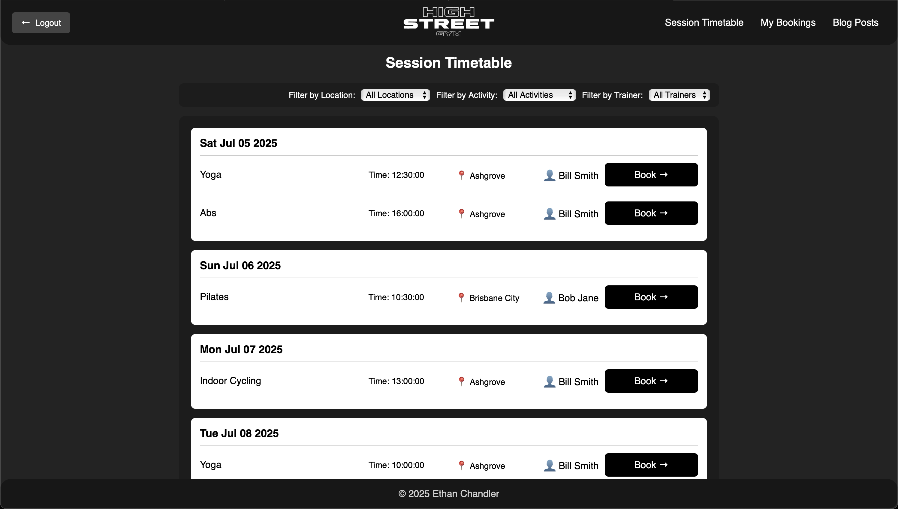

````markdown
# Gym App

This gym app is a full-stack web application that combines:

- A **server-side rendered Node.js + Express backend** (fully functional website)  
- A **mobile-first React + Vite frontend** SPA  
- A **MySQL database** for persistent storage  
- RESTful API endpoints shared between both interfaces  

---

## Project Structure

```text
Gym_App/
├── backend/                     # Fully functional SSR website (Express + Views + API)
│   ├── controllers/             # Route logic
│   ├── models/                  # DB schema/models
│   ├── public/                  # Static files (images, CSS, JS)
│   ├── views/                   # Server-rendered HTML/EJS templates
│   ├── server.mjs               # Express server entry point
│   ├── components.yaml          # API metadata
│   └── package.json
├── frontend/                    # Mobile-first React SPA (Vite + React)
│   ├── public/
│   └── src/
│       ├── authentication/
│       ├── blog/
│       ├── booking/
│       ├── common/
│       ├── profile/
│       └── timetable/
├── MySqlDbExport.sql            # MySQL schema and seed data
├── OpenAPISpecification.yaml    # OpenAPI documentation
├── docs/
│   └── screenshots/             # Place your PNGs here
├── .gitignore
├── LICENSE
└── README.md
````

---

### Prerequisites

* Node.js (v18+)
* MySQL Server
* Git

---

## Backend (SSR Site)

```bash
# from project root
npm install                      # if node_modules not already installed
npm -w backend run dev           # start backend with nodemon
```

* Starts the Express server (with nodemon)
* Access the site: [http://localhost:8080](http://localhost:8080)

Make sure to configure your DB connection string if needed (e.g., via `.env`).

### Import the MySQL Schema

```bash
mysql -u root -p
> source MySqlDbExport.sql
```

---

## Frontend (Mobile-first React app)

```bash
# from project root
npm install                      # if node_modules not already installed
npm -w frontend run dev          # start Vite dev server
```

* Starts Vite development server
* Access the SPA: [http://localhost:5173](http://localhost:5173)

### Mobile-First Design

The React frontend is designed mobile-first using responsive CSS techniques. It’s optimized for phones and tablets, with layouts progressively enhanced for larger screens.

---

## API Documentation

* API routes are documented in `OpenAPISpecification.yaml`
* Preview and test using:

  * [Swagger Editor](https://editor.swagger.io/)
  * Swagger UI

---

## Features

* Server-rendered website (backend)
* Mobile-first, modular SPA (frontend)
* User authentication system
* Timetable & booking functionality
* Blog & profile management
* Shared RESTful API (JSON-based)
* MySQL persistence layer

---

## Scripts

**Backend**

```bash
npm -w backend run dev      # Start backend server with nodemon
```

**Frontend**

```bash
npm -w frontend run dev     # Start Vite dev server
```

---

## Stack Overview

### Backend

* Node.js, Express
* EJS / HTML templating
* MySQL
* YAML / OpenAPI
* Nodemon

### Frontend

* React
* Vite
* **Tailwind CSS**
* **DaisyUI**
* Mobile-first responsive design

---

## License

MIT License. See `LICENSE` file for details.

---

## Extras

All test accounts within the database export have the password `test`.

---

## Screenshots

### Backend (Server-side rendered site)



### Frontend (Mobile‑First React App)


```
```